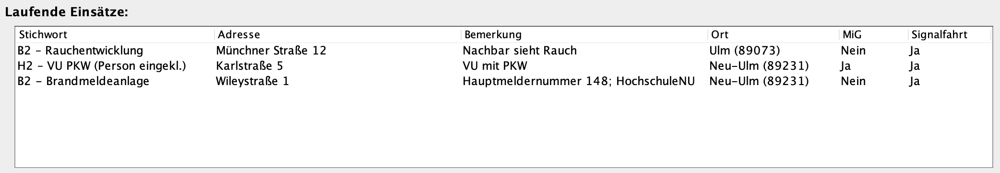
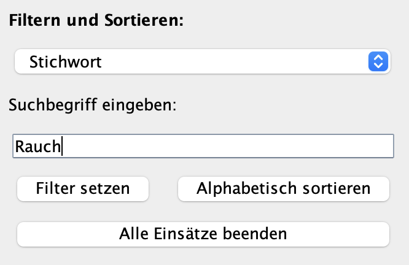

# Leitstellensystem - Projektarbeit OOP
### Projektarbeit Objektorientiertes Programmieren | 1. Semester - Digital Enterprise Management | Cosmo Stahn, Julian Schnabl

>**Kurzbeschreibung:**
>Bei dem Programm handelt es sich um ein Leitstellensystem (LSS) welches generell in Integrierten Leitstellen (ILS) der Feuerwehren und des Rettungsdienstes eingesetzt wird. Für diese Projektarbeit wurde das System im Vergleich zu einem reellen LSS vereinfacht.

## Gliederung
[1. Hintergrund](#1-hintergrund) 
[2. Einführung GUI-Fenster](#2-einführung-gui-fenster) 
[3. Erklärung einzelne Bereiche des GUI-Fensters](#3-erklärung-der-einzelnen-bereiche-des-gui-fensters) 
[4. Projektstruktur](#4-projektstruktur) 
[5. Funktionalitäten](#5-funktionalitäten) 
[6. JUnit Test](#6-junit-test) 
[7. Ausführen des Programms](#7-ausführen-des-programms) 
[8. Autoren](#8-autoren) 

## 1. Hintergrund
Über eine ILS wird die europaweite Notrufnummer 112 entgegengenommen.  
Welche Leitstelle damit erreicht wird, entscheidet sich durch die Mobilfunkmasten, in denen das Handy eingewählt ist, oder  
durch die Adresse, bei der ein Festnetzanschluss registriert ist. Die verschiedenen Leitstellen werden nach Kommunen und  
Landkreisen aufgeteilt. In Ulm ist die ILS in die Hauptfeuerwache der Feuerwehr Ulm in der Keplerstraße 38 in der  
Oststadt integriert. Diese ILS ist für das Stadtgebiet Ulm sowie für den Alb-Donau-Kreis zuständig. Für Neu-Ulm ist die  
ILS Donau-Iller zuständig, welche in Krumbach lokalisiert ist. Sollte man z. B., weil man direkt an der Donau auf der  
Neu-Ulmer Seite steht, in der ILS in Ulm rauskommen, wird der Anruf von dem Leitstellendisponenten direkt in die ILS  
Donau-Iller weitergeleitet. Die Notrufnummer 110 der Polizei wird nicht über die ILS, sondern über das Führungs- und  
Lagezentrum (FLZ) des jeweiligen Polizeipräsidiums bedient.

Bei einem eingehenden Notruf wird der Anruf von einem Leitstellendisponenten entgegengenommen, dieser führt die bekannte  
Notrufabfrage mit den W-Fragen durch und gibt die angegebenen Daten in ein LLS ein. Sobald alle grundlegenden Daten wie  
die Adresse und der Notfall klar sind, wählt der Disponent ein Alarmstichwort aus, und nach einer festgelegten Alarm- und  
Ausrückeordnung (AAO) werden entsprechende Einsatzkräfte alarmiert. Oft geschieht die Alarmierung während des Telefonats,  
und nach der Alarmierung werden weiterhin Informationen aufgenommen; diese werden weiterhin in das LSS eingegeben. Sind  
die Einsatzkräfte auf dem Weg, können so weitere Informationen über die Funkverbindung nachgereicht werden, ohne wertvolle  
Zeit zu verlieren.

#### [↑ zurück zur Gliederung](#Gliederung)

## 2. Einführung GUI-Fenster
Das GUI-Fenster beinhaltet alle wichtigen Funktionen, die ein LSS können muss. Dazu gehört die Aufnahme von Daten aus
einem Notruf-Gespräch in ein Formular, die Alarmierung und die Verwaltung der laufenden Einsätze Mithilfe von Filter-Möglichkeiten
und der alphabetischen Sortierfunktion. Ebenfalls können die Einsätze in der Übersicht beendet werden.

#### [↑ zurück zur Gliederung](#Gliederung)

## 3. Erklärung der einzelnen Bereiche des GUI-Fensters
### Das Eingabeformular

`Vorgehensweise`
Wenn der Disponent einen Anrufer in der Leitung hat, kann hier schnell die Adresse und weitere Bemerkungen des Anrufers 
aufgenommen werden. Ebenfalls kann hinterlegt werden, ob sich noch Menschen in Gefahr befinden. Wenn die Situation ausreichend
geschildert wurde, wählt der Disponent das passende Stichwort und ob die Kräfte mit Signal (Sonder- und Wegerechte mit 
Martinshorn) anfahren sollen. Mit einem Klick auf *Alarmieren* werden die Einsatzkräfte dann alarmiert.

`Bedingungen`
Zu beachten ist, dass alle Felder bis auf das Feld *Bemerkung* ausgefüllt werden müssen. Ebenfalls muss die Postleitzahl 
eine 5-stellige Zahl sein. Ein Stichwort muss in jedem Fall gewählt werden. Nur wenn diese Bedingungen erfüllt sind,
können die Einsatzkräfte alarmiert werden. Wenn sich der Anruf z.B. als böswilliger Anruf herausstellt, können mit einem 
Klick auf *Eingabe löschen* die eingegebenen Daten aus dem Formular gelöscht werden. 
Hinweis: wird im Feld *Bemerkung* keine Änderung vorgenommen, erscheint in der Einsatzverwaltung der Vermerk: '- keine Angabe'

### Laufende Einsätze

`Beschreibung`
Wenn der Disponent die Einsatzkräfte alarmiert, werden hier direkt die einzelnen Einsätze tabellarisch angezeigt. 
Hier werden die Informationen in die Spalten *Stichwort, Adresse, Bemerkung, Ort mit PLZ, Menschenleben in Gefahr (MiG) 
und Signalfahrt* angezeigt

### Einsatzverwaltung
 
`Vorgehensweise`
Wenn z.B. ein Funkspruch von einer Einsatzstelle die Leitstelle erreicht, kann über die Filterfunktion der richtige Einsatz,
gefunden werden. Hierfür muss eine Spalte nach der gefiltert werden soll ausgewählt werden, sowie ein passender Suchbegriff eingegeben werden.
Wenn es sich zum Beispiel um eine abschließende Lagemeldung handelt, kann der Einsatz mit einem Klick auf *Ausgewählte Einsätze 
beenden* beendet werden. Mit der Sortierfunktion kann man die Tabelle nach einer Spalte, die zuvor ausgewählt werden kann, 
alphabetisch sortiert werden.

`Bedingungen`
Die Buttons *Filter setzen* und *Alphabetisch sortieren* können nur verwendet werden, wenn eine Spalte aus der Combo-Box 
ausgewählt wurde, sowie beim Filtern ein Suchbegriff eingegeben wurde. Je nachdem ob gerade ein Filter gesetzt ist, werden über 
den unteren Button je nach Aufschrift entweder alle laufenden Einätze beendet oder nur die ausgewählten bzw. gefilterten 
Einsätze beendet

#### [↑ zurück zur Gliederung](#Gliederung)

## 4. Projektstruktur
Das Projekt besteht aus zwei zentralen Klassen:

- `Einsatz`: Datenklasse (Bauplan) für einen einzelnen Einsatz mit allen einsatzrelevanten Informationen.
- `Leitstellensystem`: GUI + Steuerungslogik (Verarbeitung der Eingaben und Verwaltung der Einsätze).

---
### Klasse „Leitstellensystem“ (Controller-Klasse)
Die Klasse `Leitstellensystem` erbt von `JFrame` und bildet damit das Hauptfenster der Anwendung.  
Sie kümmert sich um die komplette Benutzerinteraktion (Buttons, Eingaben), verarbeitet die Formulardaten und verwaltet die laufenden Einsätze.

---
### Klasse „Einsatz“ (Objekt-Klasse)
Die Klasse `Einsatz` dient als Bauplan für einzelne Einsatzobjekte.  
Sie speichert die Daten eines Einsatzes (z.B. Adresse, Ort, PLZ, Stichwort, MiG, Signalfahrt) und stellt diese über Getter zur Verfügung.

---
### Zusammenspiel der Klassen
`Einsatz` wird im Projekt ausschließlich als Datenobjekt verwendet und enthält keine Logik für Darstellung oder Bedienung.  
`Leitstellensystem` erstellt neue `Einsatz`-Objekte aus den Benutzereingaben, speichert sie in einer Liste und zeigt sie tabellarisch an.  
Funktionen wie Filtern, Sortieren oder Beenden laufen zentral über `Leitstellensystem`, greifen dabei aber immer auf die zugrunde liegenden `Einsatz`-Objekte bzw. deren Daten zu.

#### [↑ zurück zur Gliederung](#Gliederung)

## 5. Funktionalitäten
### 5.1 Tabellenaufbau (JTable + TableModel)
Die Einsatzübersicht wird als JTable umgesetzt. Damit die Tabelle Daten anzeigen kann, wird im Konstruktor zuerst ein `DefaultTableModel` erstellt, das die Spaltennamen festlegt und später die Zeilen (Einsätze) enthält.  
Dieses Model wird anschließend mit `einsatzTable.setModel(tableModel)` an die JTable gebunden. Neue Einsätze werden später nicht „direkt“ in die JTable geschrieben, sondern immer über das Model (z.B. mit `tableModel.addRow(...)`). Dadurch bleibt die Datenhaltung der Tabelle sauber getrennt von der GUI-Anzeige.

Daraus folgt:\
 `JTable` = Anzeige (GUI)  
 `DefaultTableModel` = Daten (Zeilen/Spalten)  
 Änderungen passieren im Model (z.B. `addRow(...)`, `removeRow(...)`) und die `JTable` zeigt das dann automatisch an.

**Read-only Tabelle:**  
In diesem Projekt ist die Tabelle absichtlich nicht direkt editierbar, damit Einsätze nicht aus Versehen in der Übersicht geändert werden.  
Das wird im Code über `einsatzTable.setDefaultEditor(Object.class, null);` umgesetzt.

---
### 5.2 Demo-Einsätze beim Start
Damit die Anwendung nicht mit einer leeren Tabelle startet, werden beim Programmstart automatisch drei Demo-Einsätze angelegt.  
Das passiert in der Methode `initObjekte()`: Dort werden mehrere `Einsatz`-Objekte erstellt und über `einsatzListe.add(...)` in der Liste `einsatzListe` (Typ: `ArrayList<Einsatz>`) gespeichert.

Direkt danach werden diese Demo-Einsätze aus der `einsatzListe` ausgelesen und über `tableModel.addRow(...)` in das `DefaultTableModel` übernommen.  
Da die JTable ihre Daten aus dem `DefaultTableModel` bekommt, erscheinen die Demo-Einsätze so direkt als Zeilen in der Einsatzübersicht.

---
### 5.3 Einsatz anlegen (*Alarmieren*)
Über das Eingabeformular kann ein neuer Einsatz aufgenommen werden.  
Beim Klick auf **Alarmieren** werden alle Werte aus den Feldern gelesen, geprüft und danach als neues Objekt der Klasse `Einsatz` gespeichert. Anschließend wird der Einsatz sowohl in die `einsatzListe` (interne Speicherung) als auch in die Tabelle eingetragen (`tableModel.addRow(...)`).

Für die Ausgabe in der Tabelle werden die Werte aus dem `Einsatz`-Objekt über Getter wie `getStichwort()`, `getAdresse()` oder `getOrt()` ausgelesen. 

**Bedingungen / Validierung**

- **Pflichtfelder:** Adresse, Hausnummer, Ort und PLZ müssen ausgefüllt sein.
- **PLZ-Prüfung:** Die PLZ darf nur aus Ziffern bestehen und muss 5-stellig sein.
- **Stichwort:** Es muss ein Stichwort ausgewählt werden (nicht „- Stichwort auswählen -“).
- **Bemerkung:** Wenn im Bemerkungsfeld nichts geändert wurde, wird „- keine Angabe“ gespeichert.

Bei Erfolg erscheint eine Info-Meldung („Einsatzkräfte wurden alarmiert“), bei falschen Eingaben eine Fehlermeldung als Dialogfenster.

---
### 5.4 Formular zurücksetzen (*Eingabe löschen*)
Mit dem Button **Eingabe löschen** wird das komplette Formular wieder in den Ausgangszustand gesetzt:
- Alle Textfelder werden geleert.
- Checkboxen werden deaktiviert.
- Die Stichwort-ComboBox springt zurück auf „- Stichwort auswählen -“.

Das ist praktisch, wenn man sich vertippt hat oder ein Einsatz doch nicht aufgenommen werden soll.

---
### 5.5 Einsätze filtern

Über die Filterfunktion kann die Einsatzübersicht gezielt durchsucht werden (z.B. nach *Ort*, *Adresse* oder *Stichwort*).  
Technisch läuft das über einen `TableRowSorter`, der an der `JTable` hängt und das Filtern/Sichtbarmachen der Zeilen übernimmt.

**Vorgehensweise**
- Spalte in der ComboBox auswählen (also **wonach** gefiltert werden soll, z.B. „Adresse“).
- Suchbegriff in das Textfeld eingeben (also **was** gesucht wird, z.B. „Karlstraße“).
- Auf **Filter setzen** klicken.

**Wie es technisch funktioniert**\
Damit der Filter weiß, in welcher Spalte gesucht werden soll, wird die Auswahl aus der ComboBox im Code zuerst in einen **Spaltenindex** übersetzt.  
Das passiert über ein `switch-case` (z.B. „Stichwort“ → Index `0`, „Adresse“ → `1`, „Ort“ → `3`, usw.), weil der Filter intern nicht mit Spaltennamen arbeitet, sondern mit Spaltennummern.

Danach wird der Filter gesetzt über:

>sorter.setRowFilter(RowFilter.regexFilter("(?i)" + suchbegriff, columnIndex));

Dabei gilt vereinfacht:
- Der `RowFilter` prüft jede Tabellenzeile in genau der ausgewählten Spalte (`columnIndex`).
- Passt der Zellinhalt zum Suchbegriff, bleibt die Zeile sichtbar.
- Passt er nicht, wird die Zeile ausgeblendet (nicht gelöscht).
- Durch `(?i)` ist die Suche unabhängig von Groß-/Kleinschreibung (z.B. „ulm“ findet auch „Ulm“).

**Bedingungen / Hinweise**
-	Es muss eine Spalte ausgewählt werden (nicht „- Spalte auswählen“).
-	Der Suchbegriff darf nicht leer sein.
-	Wenn ein Filter aktiv ist, ändert sich der Button zu Filter löschen. Ein Klick darauf entfernt den Filter wieder und zeigt alle Einsätze an.

---
### 5.6 Alphabetisch sortieren
Mit der Funktion **Alphabetisch sortieren** kann die Einsatzübersicht nach einer ausgewählten Spalte alphabetisch (A–Z) sortiert werden (z.B. nach *Ort* oder *Adresse*).  
Dafür wird – wie beim Filtern – der `TableRowSorter` genutzt, der an der Tabelle hängt. Über ihn wird eine Sortierung für genau eine Spalte gesetzt und anschließend angewendet.

**Vorgehensweise**
- Spalte in der ComboBox auswählen (die Spalte, nach der sortiert werden soll).
- Auf **Alphabetisch sortieren** klicken.

**Wie es technisch funktioniert**
Ähnlich wie beim Filtern wird die ausgewählte Spalte zuerst per `switch-case` in einen **Spaltenindex** übersetzt.  
Danach wird im `TableRowSorter` ein Sortierschlüssel gesetzt (aufsteigend)
>sorter.setSortKeys(List.of(new RowSorter.SortKey(columnIndex, SortOrder.ASCENDING) )); 
>sorter.sort();

und die Sortierung ausgeführt.

**Bedingungen / Hinweise**
- Es muss eine Spalte ausgewählt werden (nicht „- Spalte auswählen“).
- Nach dem Sortieren wird die Spaltenauswahl wieder zurückgesetzt, damit nicht aus Versehen mehrfach mit alter Auswahl sortiert wird.

---
### 5.7 Einsätze beenden (alle oder gefilterte)
Über den Button **Einsätze beenden** können Einsätze aus der Übersicht entfernt werden. Dabei werden die Einsätze nicht nur aus der Tabelle gelöscht, sondern auch aus der internen Liste `einsatzListe`, damit sie wirklich „beendet“ sind und nicht beim nächsten Schritt wieder auftauchen.

Es gibt dabei zwei Fälle:

**Kein Filter aktiv:** \
Wenn gerade **kein** Filter gesetzt ist, werden alle laufenden Einsätze beendet. Dafür wird die `einsatzListe` geleert und die Tabelle komplett zurückgesetzt (alle Zeilen werden entfernt).

**Filter aktiv:**  \
Wenn ein Filter aktiv ist, werden nur die aktuell angezeigten (gefilterten) Einsätze beendet. Das ist praktisch, wenn man z.B. einen Einsatz in der XY-Straße beenden will, kann man erst nach *Adresse* filtern und dann nur diesen Einsatz schließen.

**Wichtig (technisch):**  
Bei aktivem Filter wird Zeile für Zeile gelöscht. Da die Tabelle durch Filter/Sortierung eine andere Reihenfolge anzeigen kann als das eigentliche Tabellenmodell, wird vor dem Löschen jeweils der sichtbare Zeilenindex in den Model-Index umgerechnet (`convertRowIndexToModel(...)`). So wird auch wirklich der richtige Einsatz aus `einsatzListe` und dem `tableModel` entfernt.

Nach dem Beenden gefilterter Einsätze wird der Filter wieder zurückgesetzt (Suchfeld leer, ComboBox zurück, Button wieder auf **Filter setzen**), damit die Übersicht wieder im Normalzustand ist.

#### [↑ zurück zur Gliederung](#Gliederung)

## 6. JUnit Test
Zur Überprüfung der zentralen Programmlogik wurden **JUnit-Tests** implementiert.  
Diese Tests stellen sicher, dass wichtige Methoden der Klassen `Einsatz` und `Leitstellensystem` korrekt arbeiten.

### 6.1 Testklasse EinsatzTest
In der Testklasse `EinsatzTest` werden ausgewählte Methoden der Datenklasse `Einsatz` überprüft.

Getestet werden:
- die korrekte Zusammensetzung der vollständigen Adresse über die Methode `volladresse()`,
- die Einstufung eines Einsatzes als dringend über die Methode `istDringend()`.

Dabei werden sowohl positive als auch negative Testfälle berücksichtigt, um das erwartete Verhalten der Methoden eindeutig zu prüfen.

---

### 6.2 Testklasse LeitstellensystemTest
Die Testklasse `LeitstellensystemTest` überprüft die grundlegende Funktion der Alarmierung.

Es wird getestet, ob beim Ausführen der Methode `alarmieren()`:
- ein neues `Einsatz`-Objekt erstellt wird,
- und dieses korrekt zur internen Einsatzliste (`einsatzListe`) hinzugefügt wird.

Dadurch wird sichergestellt, dass das Anlegen neuer Einsätze im System zuverlässig funktioniert.

Die Tests sind bewusst überschaubar gehalten und konzentrieren sich auf die wichtigsten Kernfunktionen des Programms.

#### [↑ zurück zur Gliederung](#Gliederung)

## 7. Ausführen des Programms
Das Programm wird durch das Starten der Klasse `Leitstellensystem` ausgeführt.  
Nach dem Start öffnet sich eine grafische Benutzeroberfläche, über die neue Einsätze erfasst und verwaltet werden können.  
Einsätze können über Eingabefelder angelegt und anschließend in einer Tabelle angezeigt werden.  
Zusätzlich besteht die Möglichkeit, Einsätze zu filtern, alphabetisch zu sortieren sowie alle oder gefilterte Einsätze zu beenden.  
Die Anwendung ist eine Desktop-Anwendung und benötigt keine zusätzliche Konfiguration oder externe Abhängigkeiten.

#### [↑ zurück zur Gliederung](#Gliederung)

## 8. Autoren

>Cosmo Stahn *(Matrikel Nr: 392305)*  
>Julian Schnabl *(Matrikel Nr: 396345)*

`Modul: Objektorientierte Programmierung`
**Studiengang: Digital Enterprise Management (B.Sc.) 
Hochschule Neu-Ulm** 

#### [↑ zurück zur Gliederung](#Gliederung)
